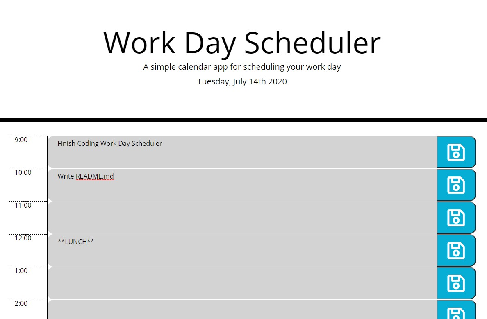

# homework-work-day-scheduler-5
### Homework Assignment #5: Work Day Scheduler

## Goal:

To create a simple scheduling app for the current workday, utilizing jQuery & moment.JS. The app should track which time block is current, and should store events in localStorage.



[Link to Deployed Project](https://gafelton.github.io/homework-work-day-scheduler-5/)

## Details/Description

This work day scheduler app utilizes a Bootstrap grid dynamically generated through jQuery. The current date is shown just under the header, and each hour is color coded (gray for past, red for present, and green for future) based on the current time. Each save button saves the contents of the adjoining text area in local storage, so it persists even if the page is reloaded.

This project gave me a good chance to practice jQuery, in addition to throwing a couple tricky challenges in my direction. I had a bit of trouble with:

1. Changing the color of the text box background based on it's relationship with the current time. I could not just return `<` or `>`, because 11am is greater than 4pm, but before it chronologically. I debated how I would compare times in different formats too, as it can be presented in AMPM, 24h, or in various time zones, as well as the merits of strings vs ASCII values. In the end, I created two functions, one that stripped the ":00" from each of my `hours` array values:

   ```javascript
   var hoursOnly = hours.map(function (value) {
       var n = value.replace(":00", "");
       return n;
   });
   ```

   And another that captured the index values for each of the stripped hours values, so when I dynamically created the table later, I could compare `hoursIndex` with `i`:

   ```javascript
   var hoursIndex = hoursOnly.findIndex(function (value, index) {
       if (value === currentHour) {
           return index;
       };
   });
   ```

2. I took a long time trying to figure out the storage structure for timeblocks - whether to put all of the text values into one big array or to create a new item for each time block. I opted for the second route, and it took some serious troubleshooting to learn a few basic quirks of javascript, such as that I needed to call a named function on "click" through an anonymous function in my for loop, otherwise it would run the named function right away:

   ```javascript
   saveBtnDiv.on("click", function () {
       var noteIndex = $(this).attr("data-SaveBtn");
       console.log(noteIndex);
       storeNote(noteIndex);
   });
   ```

   Or that I need to make my console window bigger, because my function for pulling note values worked for those time boxes where I had values, but not for those which returned "null." (Which meant I had to add the if statement testing for `!== null`.)

   ```javascript
   function pullNotes() {
       for (i = 0; i < hours.length; i++) {
           var noteToSet = JSON.parse(localStorage.getItem(("note-" + i)));
           if (noteToSet !== null) {
               console.log(noteToSet.note);
               $(".textarea-" + i).text(noteToSet.note);
           }
       }
   }
   ```

   

All in all, I learned a lot through this project. If I were to continue working on it, there are a few more changes I would make (outside the scope of the homework assignment).

### Future features:

* Clear all the text areas when the date changes - write a function that moment.JS against a data attribute where the last loaded date is stored. When those values do not match up, clear all the text areas (and their corresponding objects in local storage) and update the date listed in the header.
* Add a delete button to each text field - currently each field's current state is captured by the save button, so a user could simply delete the text themselves and save that. But a delete button could also clear local storage and make manipulating the schedule much easier.
* Allow users to specify their own range of times to display - currently what is holding this back is the `hours` array, which is hardcoded. But if I created an array for 24 hours and let the user decide (via dropdowns) their own range of hours, I could get around this limitation.

